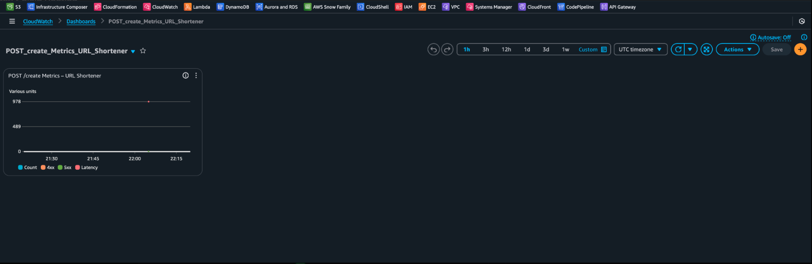
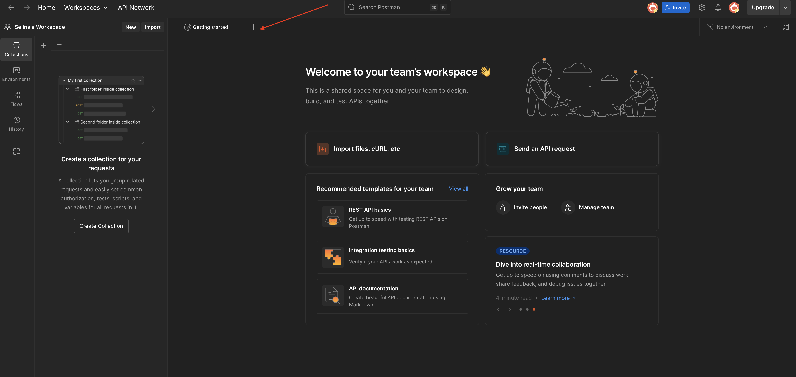
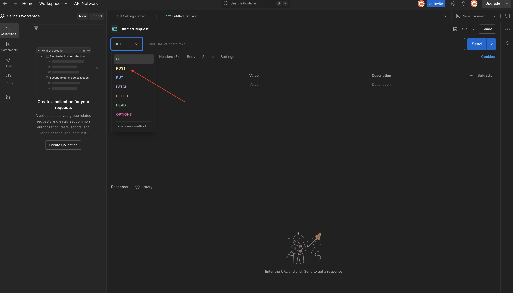

# 📸 Project Documentation & Visuals

This folder contains supporting documentation and images related to the **Serverless URL Shortener** project.

---

### ✅ Included Screenshots

#### 1. **CloudWatch Dashboard**

#### 2. **Postman - Selecting POST Method**

#### 3. **Postman - New Request Setup**

---

### 📝 Medium Article
📖 [Read the Full Walkthrough on Medium](https://www.medium.com/@tati.fluffy) *(replace with full link when published)*

---

### 🔍 Use these assets for:
- Blog posts  
- GitHub visuals  
- Demo presentations  
- Troubleshooting reference

